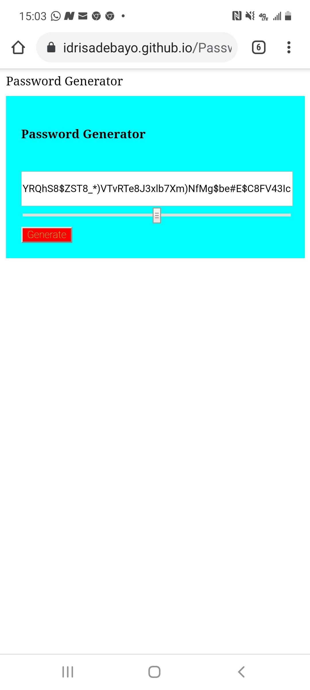

# Password-Generator
A website that generates random passwords

## Table of Contents (Optional)

If your README is very long, add a table of contents to make it easy for users to find what they need.

* [Usage](#usage)
* [deployed link](#deployed link)
* [description](#description)
* [Credits](#credits)

## Usage 
Image of finished project

## deployed link: https://idrisadebayo.github.io/Password-Generator/

## description
In building up my profile as a developer, I attempted this project to practice the javascript skills I got introduced to in the past week.

The user uses a slider to set random password length to determine length that is preset between  8 and 128 characters picked randomly from lowercase letters, uppercase letters, numbers and special characters.

A key aspect of Javascript that stuck with me here is the iteration and the practice of creating    and calling functions.

Seeing how to use a combination of the Math.random and the Math.floor function was deeply satisfying

## Credits
My most profound gratitude goes to Andrew Kemp for helping look through a problematic aspect of the code.

I need to also gice credit to my class Instructor Jon Lynch and Cody

I believe it is the further step to a wider world of possibilities in Software development

